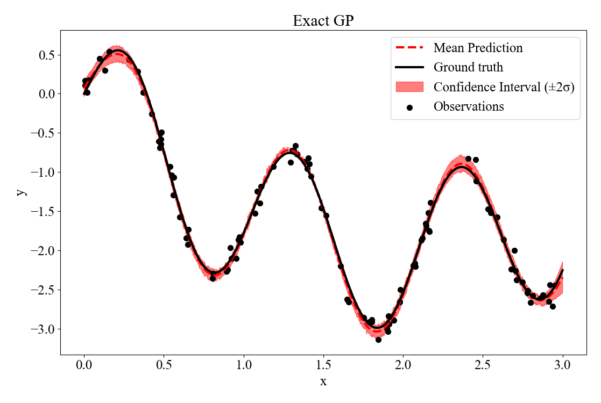
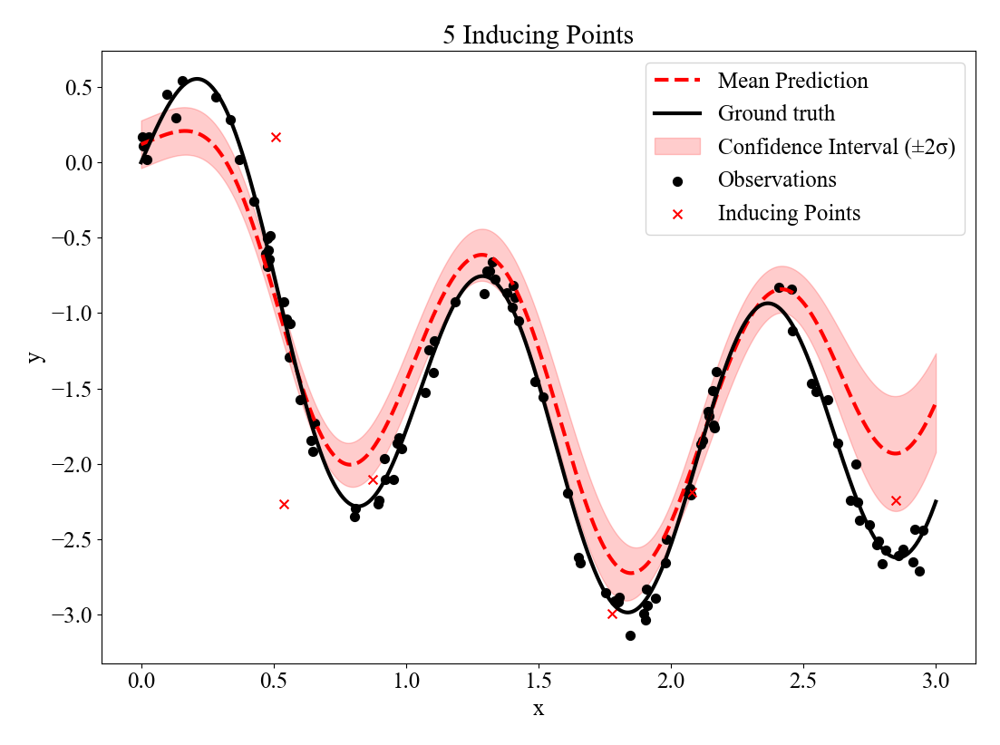

# sparse_GP
Toy problem to learn sparse GPs

The problem set up is as follows:

$y=f(x)+\boldsymbol{\epsilon}_{n}$

where $y$ and $x$ are observed and the function values are to be learned and evaluated at new values of $x$. In conventional Gaussian processes, the posterior over functions $p(f|y)$ is required. This can be calculated by considering the joint Gaussian distribution $p(y,f)$ and then conditioning on $y$ using standard identitites:

$p(f|y)=\mathcal{N}\left(K_{TX}K_{XX}^{-1} y,K_{TT}-K_{TX}K_{XX}^{-1}K_{XT}\right)$

where there are N training points and f is evaluated at T test points. This is implemented in the model file as `exact_GP'. The inversion of the $$N\times N$$ matrix $K_{XX}$ limits this method to N<10,000, hence it is not applicable to larger datasets. Therefore sparse GPs must be used.

The idea is to represent the posterior over functions, $p(f|y)$ using a variational distribution $q(f)$:

$p(f|y)=\int{p(f|u)p(u|y)}du=\int{p(f|u)q(u)}du$

hence it is actually a variational distribution over the inducing points u. This assumes that the distribution over the functions can be represented by essentially fitting a GP to a set of artificial points. These artificial points distill the large dataset down into a smaller subset of M `well placed' points. If M<<N then inference can be much more efficent. This variational distribution is assumed to be Gaussian:

$q(u)=\mathcal{N}\left(m,S\right)$

This distribution is defined in terms of the variational parameters m, S and Z, where Z represents the position of M inducing points. To fit the parameters, $q(u)$ is optimised to be close to the true posterior over u by minimising the KL divergence between the two distributions KL(q(u)||p(u|y)):

$KL(q(u)||p(u|y))=\int{\log{\left[\frac{p(u|y)}{q(u)}\right]}q(u)du}=\int{\log{\left[\frac{p(y|u)p(u)}{p(y)q(u)}\right]}q(u)du}=\int{\log{\left[p(y|u)\right]}q(u)+\log{\left[\frac{p(u)}{q(u)}\right]}q(u)du}+C$

The term $p(y)$ can be ignored because it is a constant in the optimisation process. This can be used to calculated an Evidence Lower Bound (ELBO):

$ELBO=E_{q(u)}[p(y|u)]-KL(q(u)||p(u))$

Optimising this drives the variational distribution $q(u)$ towards the true posterior. The first term encourages it to fit the data well, and the second term drives it towards the prior. Given everything is Gaussian, these terms can both be evaluated analytically to give an expression to be maximised. First consider 

$E_{q(u)}[p(y|u)]=\int{p(y|u)q(u)du}=\int{p(y|f)\int{p(f|u)q(u)du}df}$

where

$q(f)=\int{p(f|u)q(u)du}$

This term is an approximation for the posterior over f, given the data. This must first be estimated by considering the conditional distribution of $\mathbf{f}$ given $\mathbf{u}$. This can be written as:

$p(\mathbf{f} | \mathbf{u}) \sim \mathcal{N} \left( K_{\mathbf{X Z}} K_{\mathbf{Z Z}}^{-1} \mathbf{u}, K_{\mathbf{X X}} - K_{\mathbf{X Z}} K_{\mathbf{Z Z}}^{-1} K_{\mathbf{Z X}} \right)$

where $K_{XZ}$ represents the covariance matrix between the input training X points and the inducing points Z. This can be derived using standard results from the joint distribution. We can therefore write:

$f=K_{\mathbf{X Z}} K_{\mathbf{Z Z}}^{-1} \mathbf{u}+K_{\mathbf{X X}} - K_{\mathbf{X Z}} K_{\mathbf{Z Z}}^{-1} K_{\mathbf{Z X}}$

and because u is a Gaussian random variable:

$f=K_{\mathbf{X Z}} K_{\mathbf{Z Z}}^{-1} \mathbf{m}+K_{\mathbf{X Z}} K_{\mathbf{Z Z}}^{-1}SK_{\mathbf{Z Z}}^{-1}K_{\mathbf{ZX}}+K_{\mathbf{X X}} - K_{\mathbf{X Z}} K_{\mathbf{Z Z}}^{-1} K_{\mathbf{Z X}}$

again from standard results for multivariate Gaussians. We have therefore calculated an expression for $q(f)$:

$q(f) \sim \mathcal{N}\left(K_{\mathbf{X Z}} K_{\mathbf{Z Z}}^{-1} \mathbf{m}, K_{\mathbf{X Z}} K_{\mathbf{Z Z}}^{-1}SK_{\mathbf{Z Z}}^{-1}K_{\mathbf{X Z}}^{T}+K_{\mathbf{X X}}-K_{\mathbf{X Z}} K_{\mathbf{Z Z}}^{-1} K_{\mathbf{Z X}} \right)$

Now,

$\int{p(y|f)q(f)df}$

where

$y=f+\boldsymbol{\epsilon}_{n}$

which just adds the additional of the noise identity so

$E_{q(u)}[p(y|u)]= \mathcal{N}\left(y; K_{\mathbf{X Z}} K_{\mathbf{Z Z}}^{-1} \mathbf{m}, K_{\mathbf{XZ}} K_{\mathbf{ZZ}}^{-1}S K_{\mathbf{Z Z}}^{-1}K_{\mathbf{ZX}}+K_{\mathbf{X X}}-K_{\mathbf{X Z}} K_{\mathbf{Z Z}}^{-1} K_{\mathbf{Z X}} +\sigma_{n}^{2}I \right)$

Hence, this term can be calculated analytically, given the hyperparameters on the covariance matrix ($l$, $\sigma_{n}$ and $\sigma$), the inducing point locations (Z) and the variational parameters (m and S). To avoid the $O(N^3)$ complexity when evaluating this expectation, A Nystrom approximation is used by assuming that $K_{\mathbf{X X}}\approx K_{\mathbf{X Z}} K_{\mathbf{Z Z}}^{-1} K_{\mathbf{Z X}}$. The remaining covariance can be inverted efficently using the Woodbury identity. The overall complexity is then $$O(NM^2)$$. The second term in the ELBO is the KL divergence between two Gaussian distributions, $q(u) \sim \mathcal{N}\left(m, S\right)$ and $p(u) \sim \mathcal{N}\left(0, K_{ZZ}\right)$. This is a standard result equal to 

$\text{KL}(q(u) \parallel p(u)) = \frac{1}{2} \left[ \text{tr}(S^{-1} K_{\mathbf{ZZ}}) + m^T K_{\mathbf{ZZ}}^{-1} m - d + \log \frac{\det K_{\mathbf{ZZ}}}{\det S} \right]$

The ELBO is therefore maximised (by minimising -ELBO) by optimising the hyperparameters, the variational parameters, and the inducing point locations. The resulting variational distribution can then be used to estimate the function value at T test points $f^{*}$:

$p(f^{*}|y) \mathcal{N}\left(K_{\mathbf{T Z}} K_{\mathbf{Z Z}}^{-1} \mathbf{m}, K_{\mathbf{T Z}} K_{\mathbf{Z Z}}^{-1}SK_{\mathbf{Z Z}}^{-1}K_{\mathbf{ZT}}+K_{\mathbf{T T}}-K_{\mathbf{T Z}} K_{\mathbf{Z Z}}^{-1} K_{\mathbf{Z X}}\right)$

In both the training and prediction stage, the matrix $K_{XX}$ is now not inverted; only $K_{ZZ}$ is inverted which is ideally considerably smaller. The information from N datapoints can therefore be distilled down into M inducing points efficently.

This is implemented in the `sparse_GP' class in the model file. The two figures below show an exact GP and a sparse GP with 5 inducing points. When 5 inducing points are used the apprxoimation is reasonable but imperfect. Optimising the inducing points location is challenging.

